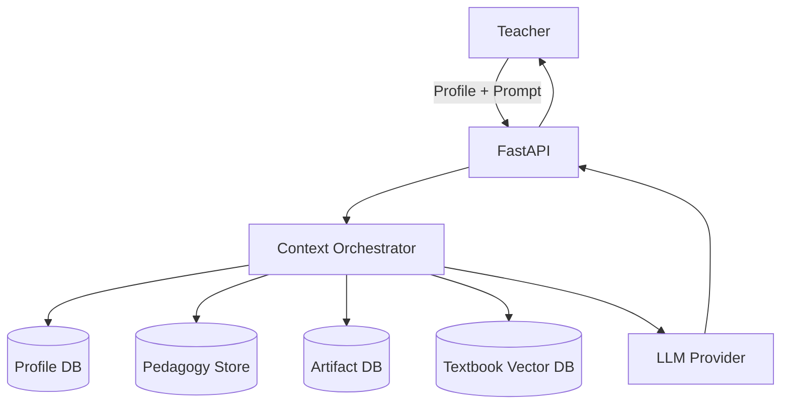

# AI Teaching Assistant Platform – MVP Design Document

**Owner:** CEO / Lead PM / Lead SWE  
**Company:** Early-stage SV EdTech startup  
**Initial Time Horizon:** ~3 months to ship a small usable product (backend + notebooks, UI later)

---

## 1. Executive Summary & Value Proposition

**Tagline:**  
> **We run the enterprise AI. You run the classroom.**

We are building **enterprise AI for teachers** – the most forgotten knowledge workers in edtech. Today, ESL and K-12 teachers are implicitly asked to behave like ML engineers: experimenting with local models, wiring up RAG, and learning prompt tricks on top of an already overloaded job. Our platform flips this: **we operate the enterprise-grade AI layer – infra, models, retrieval, and safety – so teachers can focus entirely on their students.**

The product combines **textbook-grounded RAG** with **classroom profiles** and a **curriculum memory**:

- It **stays strictly grounded** in the school’s approved textbooks and materials (no open-internet drift, no mystery sources).
- It **understands context** – grade level, language level, and pedagogy – so output is age-appropriate and usable in real classrooms.
- It **remembers what was taught**, letting teachers generate targeted reviews and exams based on their actual teaching history.

For teachers and schools, the value is simple:

- **Save hours of prep time every week** by generating quizzes, worksheets, and lesson plans in minutes instead of from scratch.
- **Improve quality and consistency** of materials through domain-aware, curriculum-safe AI instead of ad-hoc chatbot prompts.
- **Refocus on what matters most – the children** – while the platform quietly handles all the LLMs, RAG pipelines, and “prompt engineering” behind the scenes.

The experience is intentionally simple:  
**pick your class → pick your book → describe what you need.**  
Everything else – embeddings, retrieval, safety filters, pedagogy prompts – is abstracted away inside the enterprise AI layer.

---

## 2. Scope, Goals & Non-Goals

### 2.1 Product Vision (MVP)

We are building an AI Teaching Assistant that:

1. Grounds all content in ingested textbooks (RAG, no free-form guessing).  
2. Adapts to classroom context (profile: grade, book, pedagogy).  
3. Tracks curriculum over time (artifacts and timelines).

### 2.2 MVP Goals

- **Feature 1 – Textbook RAG Engine (in progress):**  
  Ingest ESL/Science textbooks, enforce curriculum safety (e.g., “up to Unit 3 only”), and generate quizzes/lessons.

- **Feature 2 – Classroom Context / Profile Engine:**  
  Persist class profiles (grade, chosen book, pedagogy) and inject them into every RAG call.

- **Feature 3 – Curriculum Graph / Memory:**  
  Save generated artifacts (quizzes, lesson plans), track them over time, and use them for cumulative reviews.

### 2.3 Constraints / Non-Goals (MVP)

- **UI/UX out of scope** for now:
  - Minimal API (FastAPI).
  - Jupyter notebooks for end-to-end demos.
- No complex auth/billing or mobile app.
- No on-prem deployments in MVP.

---

## 3. Personas & High-Level Use Cases

### 3.1 Personas

1. **The Planner (Primary)**  
   - K-12 teacher planning weekly lessons.  
   - Cares about: age-appropriate content, alignment with textbook, saving time.

2. **The Reviewer**  
   - Same teacher, reviewing a term or semester.  
   - Cares about: what has actually been taught, generating reviews and exams.

3. **Admin / Platform Owner**  
   - Manages textbook ingestion, platform configuration, and teacher onboarding.

### 3.2 High-Level Use Cases

- Plan a week of lessons aligned with a specific textbook and unit range.  
- Generate quizzes, worksheets, and review materials in minutes.  
- Save and reuse effective materials over time.  
- See what has been covered this month/term and generate targeted review content.

---

## 4. User Stories (Consolidated View)

### 4.1 Epic A – Textbook RAG Engine (Feature 1)

**Objective:** Let teachers generate grounded quizzes/lessons from specific textbooks with curriculum safety.

| ID   | As a…    | I want…                                                                          | So that…                                                   |
|------|----------|----------------------------------------------------------------------------------|------------------------------------------------------------|
| A1   | Admin    | to upload a textbook PDF and have it automatically ingested & indexed           | teachers can use it without manual data entry             |
| A2   | Teacher  | to select a specific textbook/edition from a library                            | the AI only uses the book I actually teach from           |
| A3   | Teacher  | to generate a quiz for Unit 3 using only Units 1–3                              | I don’t accidentally expose content from future units     |
| A4   | Teacher  | to generate lesson plans grounded in the selected textbook                      | my materials are consistent with the curriculum           |
| A5   | System   | to handle 100+ teachers clicking “Generate” at the same time                    | the platform stays stable during peak usage               |

**Acceptance highlights:**

- All retrieval is filtered by `book_id`.  
- Curriculum Guard: `sequence_index <= max_sequence_index`.  
- Concurrent generation is handled via Celery/Redis.

---

### 4.2 Epic B – Classroom Context / Profile Engine (Feature 2)

**Objective:** Persist classroom context (grade, book, pedagogy) and inject it automatically into every generation.

| ID   | As a…   | I want…                                                                                   | So that…                                              |
|------|---------|-------------------------------------------------------------------------------------------|-------------------------------------------------------|
| B1   | Teacher | to create a “Class Profile” (grade, subject, class name)                                  | the AI understands who my students are                |
| B2   | Teacher | to link a specific textbook to my profile via a search + confirmation “handshake”         | I am sure the AI uses the correct book/version        |
| B3   | Teacher | to automatically apply teaching best practices (e.g., “ESL Grade 5 gamified”)             | I don’t have to write long system prompts             |
| B4   | Teacher | to enable/disable specific strategies (e.g., strict grammar vs. conversation focus)       | I can control how formal/strict the AI should be      |
| B5   | Teacher | to save these settings as named profiles (e.g., “Tuesday Grammar Class”)                  | I can reuse them week after week                      |
| B6   | Teacher | to switch profiles in one click                                                           | I can move from “Grade 2 Math” to “Grade 8 Physics” fast |
| B7   | Teacher | the generated output to automatically match the reading level defined in my profile       | students get age-appropriate content                  |

---

### 4.3 Epic C – Curriculum Graph / Memory (Feature 3)

**Objective:** Track what has been taught and use it for cumulative reviews and exams.

| ID   | As a…   | I want…                                                                                 | So that…                                                 |
|------|---------|-----------------------------------------------------------------------------------------|----------------------------------------------------------|
| C1   | Teacher | to “promote” a generated quiz/lesson into a saved artifact                             | I can reuse good content later                          |
| C2   | Teacher | to see a timeline/list of artifacts per profile                                        | I can quickly see what I taught last week/month         |
| C3   | Teacher | to ask “Review last week/month” and have the AI assemble a review based on past artifacts | reviews reflect what we actually covered, not generic   |
| C4   | Teacher | to filter artifacts by type (quiz, lesson, vocab list)                                 | I can easily find the right material                    |

---

### 4.4 Non-Teacher/System Stories

| ID   | As a…    | I want…                                                          | So that…                                |
|------|----------|------------------------------------------------------------------|-----------------------------------------|
| S1   | Admin    | an ingestion pipeline that can be run via CLI/worker            | I can add new textbooks without dev work|
| S2   | Engineer | well-defined services and DI-friendly code                      | I can test and extend the system safely |
| S3   | Platform | clear scaling boundaries (when to partition DB, etc.)           | we can grow to 1K+ books without rewrite|

---

## 5. System Architecture (High Level)

### 5.1 Tech Stack

- **Backend / API:** FastAPI (async).  
- **Ingestion Workers:** Python (Docling + LlamaParse + LlamaIndex).  
- **Vector Store:** LlamaIndex + **PGVector** on PostgreSQL 16+.  
- **Relational DB:** PostgreSQL 16+ (managed).  
- **Async Queue:** Redis + Celery.  
- **Caching:** Redis.  
- **LLM:** OpenAI / Gemini (configurable).

### 5.2 Core Components

1. **IngestionService** – orchestrates PDF → structure nodes → content atoms → vector store.  
2. **SearchService** – runs filtered retrieval over content atoms.  
3. **ContextOrchestrator** – the “brain” combining Profile + Pedagogy + History + Content.  
4. **Profile Service** – CRUD for class profiles.  
5. **Artifact Service** – saving and retrieving curriculum artifacts (with hybrid search).  
6. **Job Queue (Celery)** – handles heavy RAG jobs and spikes.



---

## 6. Data Model & Storage

### 6.1 Textbook & Content (Feature 1)

**Relational layer – Structure Nodes**

```sql
CREATE TABLE structure_nodes (
    id UUID PRIMARY KEY DEFAULT gen_random_uuid(),
    book_id UUID NOT NULL,
    parent_id UUID REFERENCES structure_nodes(id),
    node_level INTEGER,       -- 0=Book, 1=Unit, 2=Section, 3=Exercise
    title TEXT,
    sequence_index INTEGER,   -- used for curriculum safety; monotonically increasing
    meta_data JSONB           -- e.g., {"page_start": 10, "page_end": 12}
);
```

**Vector layer – ContentAtoms**

- LlamaIndex manages `content_atoms` (or equivalent) with columns:
  - `id`, `text`, `embedding`, `metadata JSONB`.
- Metadata includes: `book_id`, `node_id`, `atom_type`, `sequence_index`, etc.

> **Curriculum Guard:** `sequence_index` is denormalized into metadata at ingestion so we can filter directly in vector search.

### 6.2 Profiles (Feature 2)

Pydantic-style model:

```python
from datetime import datetime
from typing import List, Dict
from uuid import UUID

from pydantic import BaseModel

class PedagogyConfig(BaseModel):
    teaching_style: str = "Standard"  # e.g. "TPR", "Gamified"
    tone: str = "Encouraging"
    special_needs: List[str] = []     # e.g. ["Dyslexia Friendly"]

class ContentScope(BaseModel):
    primary_textbook_id: str
    supplementary_ids: List[str] = []
    allowed_external_search: bool = False

class TeacherProfile(BaseModel):
    id: UUID
    user_id: str
    name: str              # "Tuesday Grammar Class"
    grade_level: int

    pedagogy: PedagogyConfig
    content: ContentScope

    created_at: datetime
```

Backed by a `profiles` table in Postgres.

### 6.3 Artifacts / Curriculum Graph (Feature 3)

Pydantic-style:

```python
from datetime import datetime
from typing import List, Dict
from uuid import UUID
from pydantic import BaseModel

class ArtifactType(str):
    LESSON_PLAN = "lesson_plan"
    QUIZ = "quiz"
    VOCAB_LIST = "vocab_list"

class Artifact(BaseModel):
    id: UUID
    profile_id: UUID          # FK -> TeacherProfile

    type: ArtifactType
    title: str
    summary: str              # short description (basis for embedding)
    content_blob: Dict        # full structured content (JSON)

    tags: List[str] = []
    textbook_refs: List[str] = []  # chapter IDs, page refs
    created_at: datetime
```

DB model (example with pgvector):

```python
from typing import List, Optional
from uuid import UUID
from datetime import datetime

from sqlmodel import SQLModel, Field, Column, JSON
from pgvector.sqlalchemy import Vector

class ArtifactDBModel(SQLModel, table=True):
    __tablename__ = "class_artifacts"

    id: UUID = Field(primary_key=True)
    profile_id: UUID = Field(index=True)
    artifact_type: str
    title: str
    summary_text: str
    content_json: dict = Field(sa_column=Column(JSON))
    created_at: datetime
    embedding: List[float] = Field(sa_column=Column(Vector(1536)))
```

---

## 7. Detailed Feature Specifications

### 7.1 Feature 1 – Scalable Textbook RAG Engine

#### 7.1.1 Functional Requirements

- **FR1.1** PDF ingestion must create:
  - `structure_nodes` hierarchy.
  - `ContentAtom` entries in the vector store.
- **FR1.2** Teachers can generate quizzes/lessons for a specific textbook & unit range.
- **FR1.3** All retrieval must be **hard-scoped** by:
  - `book_id`
  - `sequence_index ≤ max_sequence_index`
- **FR1.4** The platform must support 100 concurrent “Generate” operations using async workers.

#### 7.1.2 Ingestion Architecture

Steps:

1. **IngestionService (entrypoint)**  
   - Receives `book_id`, PDF path, metadata (title, grade level).
2. **HybridIngestor**  
   - Docling → layout, sections.  
   - LlamaParse → fallback for complex pages.  
   - Outputs `StructureNode`s + `ContentAtom`s.
3. **Persistence**  
   - `StructureNodeRepository` writes relational hierarchy to Postgres.
4. **Vector Indexing**  
   - LlamaIndex builds nodes and writes to PGVector with metadata:
     - `book_id`, `node_id`, `sequence_index`, `atom_type`, etc.
5. **Async Enrichment** (optional)  
   - Post-processing (vision, OCR fixes) via Celery tasks.

#### 7.1.3 Search & Generation

- **SearchService.search_content**:
  - Input: `query`, `book_id`, `max_sequence_index`.
  - Uses LlamaIndex metadata filters like:  
    `("book_id", "==", book_id)` and `("sequence_index", "<=", max_sequence_index)`.
  - Output: list of `AtomHit` objects (text + metadata).

- **Generation**:
  - `PromptFactory` picks prompt template (category: language/STEM/history).
  - Injects retrieved `AtomHit`s as **Source Material** into the final prompt.

#### 7.1.4 API & Scaling

Pattern:

1. Frontend/notebook calls `POST /generate_quiz`.
2. FastAPI enqueues a Celery task (`generate_quiz_task`) with parameters:
   - `profile_id` or direct `book_id` + unit range.
3. Redis stores job status.
4. Worker executes:
   - retrieval → prompt assembly → LLM call → store result.
5. Client polls `GET /jobs/{job_id}`.

---

### 7.2 Feature 2 – Classroom Context / Profile Engine

#### 7.2.1 Objective

“Stop over-prompting.” Persist context once (grade, book, pedagogy), then reuse it for all future interactions.

#### 7.2.2 Architectural Pattern – Context Injection

Key idea: The main generation function accepts a **Context Object** instead of raw flags.

```python
class ContextOrchestrator:
    def __init__(self, profile_db, vector_db, artifact_db, pedagogy_store):
        self.profile_db = profile_db
        self.vector_db = vector_db
        self.artifact_db = artifact_db
        self.pedagogy_store = pedagogy_store

    async def generate_response(self, user_query: str, profile_id: str):
        # 1. Fetch profile
        profile = await self.profile_db.get(profile_id)

        # 2. Pedagogy rules
        system_instructions = self._get_pedagogy_prompt(profile.pedagogy)

        # 3. (Optional) memory layer will go here (Feature 3)
        past_context = ""

        # 4. Strict textbook retrieval
        book_facts = await self.vector_db.similarity_search(
            query=user_query,
            filter={"book_id": profile.content.primary_textbook_id}
        )

        # 5. Assemble final prompt
        final_prompt = f"""
        {system_instructions}

        TEXTBOOK SOURCE MATERIAL:
        {book_facts}

        USER QUESTION:
        {user_query}
        """

        return await llm.predict(final_prompt)

    def _get_pedagogy_prompt(self, config):
        # placeholder: later fetch from Pedagogy DB
        return "You are a helpful teaching assistant. Adapt tone and difficulty to the class profile."
```

**Decoupling strategy:**

- **Profile DB**: owns configuration and links (`book_id`, pedagogy tags).
- **Pedagogy DB**: owns generalized teaching rules/prompts.
- **Content DB**: owns textbook content; doesn’t know about pedagogy.
- **Orchestrator**: only place where all three come together.

#### 7.2.3 Pedagogy Store

- Can start as a simple JSON file, later become a small vector store.
- Example entry:

```json
{
  "tag": "ESL_A2_GRADE5",
  "strategy": "Use simple sentences. Use TPR. Avoid idioms. Ask comprehension questions."
}
```

---

### 7.3 Feature 3 – Curriculum Graph / Memory

#### 7.3.1 Objective

Capture what has **actually** been taught (quizzes, lesson plans) so we can generate:

- End-of-unit review.  
- Mid-term/semester exams.  
- Personalized recaps (“review last week”).

#### 7.3.2 Functional Requirements

- **FR-04**: Promote a chat response into a saved **Artifact**.  
- **FR-05**: List/timeline of artifacts filtered by `profile_id`.  
- **FR-06**: Support “meta-queries” over artifacts (“Summarize the last 4 quizzes”).  

#### 7.3.3 Hybrid Retrieval Logic

1. **Pre-filter (SQL)**  
   - Filter artifacts by `profile_id`, optional `date_range`, and `type`.
2. **Vector Search (pgvector)**  
   - Run semantic search on `summary_text` or derived embeddings.
3. **Result**  
   - Small set of artifacts representing relevant past lessons/quizzes.

Pseudo-flow:

```python
relevant_artifacts = await artifact_db.hybrid_search(
    query=user_query,      # e.g. "review last week on past tense"
    profile_id=profile_id,
    artifact_type="quiz",
    limit=3
)
past_context = format_artifacts(relevant_artifacts)
```

#### 7.3.4 Orchestrator + Memory

When the user asks for review (“review”, “last week”, “last month”…):

1. Orchestrator queries `ArtifactDB` via hybrid search.
2. Adds a section to prompt:

```text
CONTEXT FROM PAST LESSONS:
- Quiz #1: Past tense regular verbs (Unit 3)
- Lesson Plan: Holiday vocabulary (Unit 4)
...
```

3. Also queries textbook vector DB for the same topics.
4. LLM synthesizes a cumulative review lesson/quiz.

---

## 8. Curriculum Guard (Sequence Index Filtering)

**Problem:** Teachers must not accidentally expose future content (e.g., Unit 6) when generating materials for Unit 3.

### 8.1 Design

- Each `StructureNode` has a `sequence_index`.
- During ingestion, `sequence_index` is copied into each `ContentAtom`’s metadata.
- Searches include filter: `sequence_index <= max_sequence_index`.

### 8.2 API Behavior

- API accepts `max_sequence_index` or a higher-level `current_unit` parameter.
- Frontend/notebook can:
  - Resolve `current_unit → max_sequence_index` using the `structure_nodes` table.
  - Send `max_sequence_index` with the query.

---

## 10. Engineering Practices & Testing

### 10.1 Design Principles

- **Single Responsibility Principle (SRP)**
  - `IngestionService` orchestrates but doesn’t parse itself.
  - Repositories handle persistence only.
  - `SearchService` only searches, doesn’t format prompts.
- **Dependency Injection**
  - Services accept repositories/clients via constructors for testability.
- **Domain Agnosticism**
  - Core RAG works on generic `ContentAtom` / `AtomHit`, not ESL-specific types.
  - ESL, STEM, History differences handled via metadata + prompts.

### 10.2 Testing Strategy (TDD)

- **Unit Tests**
  - Parsing single page → nodes / atoms.
  - Sequence index propagation.
  - Profile and artifact model validations.
- **Integration Tests**
  - Ingest a toy textbook; then run a RAG query with `max_sequence_index` and verify no leakage from future units.
  - Orchestrator assembling prompt from profile + pedagogy + content.
- **Notebook Scenarios (End-to-End)**
  - Scenario 1: “Generate quiz for Unit 2, Grade 5 ESL.”
  - Scenario 2: “Switch profile to Grade 8 Physics and generate different style content.”
  - Scenario 3: “Save quiz artifacts and generate a review based on last 4 artifacts.”

---

## 11. Open Questions & Risks

- **Book Coverage:** Which textbook series and how many books do we support in MVP?
- **LLM Provider Lock-in:** Do we need abstraction to support OpenAI + Gemini + local models?
- **Latency vs. Cost:** How aggressive should we be with caching / batching requests?
- **Privacy / Compliance:** Any student data in artifacts? (Ideally no; keep artifacts teacher-facing only.)
- **Future UI:** Keep APIs/UI-agnostic enough so a separate frontend team can plug in later without backend refactors.
