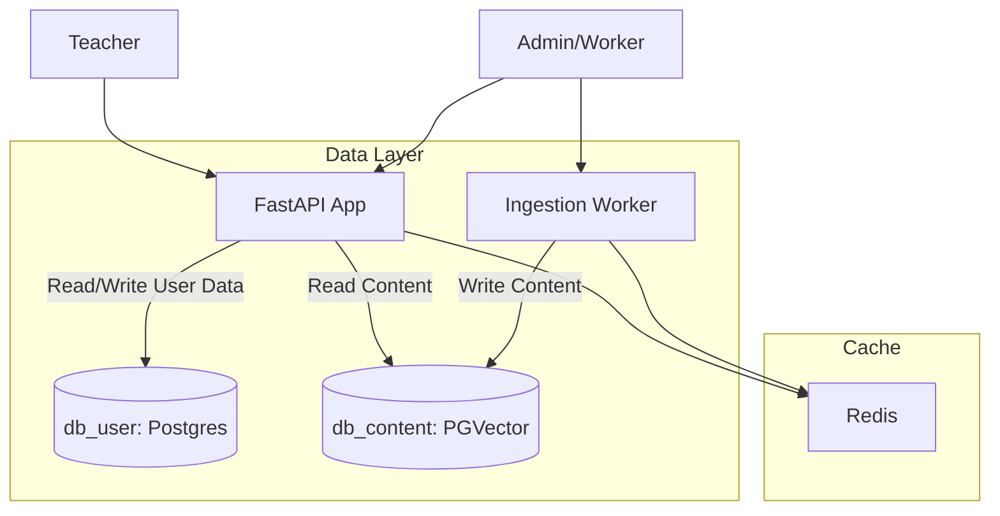

# Infrastructure & Hosting Plan

This document outlines the hosting strategy for the AI Teaching Assistant Platform, moving from a monolithic MVP setup to a scalable, split-database architecture.

## 1. Architecture Overview (Split-Database)

To support the separation of **Global Static Content** (Textbooks, Pedagogy) from **User-Specific Data** (Profiles, Artifacts), we are splitting the database layer into two distinct services.

### 1.1 `db_content` (Read-Mostly)
*   **Purpose:** Stores large, static datasets that are shared across all users.
*   **Data:**
    *   `structure_nodes` (Book Hierarchy)
    *   `content_atoms` (Vector Data for RAG)
    *   `pedagogy_strategies` (Global teaching guides + User-created extensions)
*   **Characteristics:**
    *   High read volume (RAG retrieval).
    *   Writes happen primarily during **Ingestion** (Admin) or when users add custom pedagogy.
    *   Can be scaled/partitioned by `book_id` in the future.

### 1.2 `db_user` (Read-Write)
*   **Purpose:** Stores user-specific application state and history.
*   **Data:**
    *   `teacher_profiles` (Settings, active book links)
    *   `class_artifacts` (Generated quizzes, lessons, history)
*   **Characteristics:**
    *   High write volume (saving artifacts, updating profiles).
    *   Strictly scoped by `user_id` / `profile_id`.
    *   Requires frequent backups (user data is critical).

### 1.3 Service Diagram (Docker/Cloud)

## 2. Docker Compose (Local Development)

The `docker-compose.yml` will be updated to reflect this split:

*   **`db_content`**: `pgvector/pgvector:pg16`
    *   Port: `5432` (Internal), `5433` (Host mapping to avoid conflict)
*   **`db_user`**: `postgres:16` (or `pgvector` if artifacts need vector search)
    *   Port: `5432` (Internal), `5434` (Host mapping)
*   **`app`**:
    *   Env: `POSTGRES_CONTENT_HOST=db_content`, `POSTGRES_USER_HOST=db_user`
*   **`worker`**:
    *   Env: `POSTGRES_CONTENT_HOST=db_content`, `POSTGRES_USER_HOST=db_user`

## 3. Cloud Hosting Strategy (GCP Focus)

While the MVP runs on Docker, the target production environment is **Google Cloud Platform (GCP)**.

### 3.1 Recommended Services

*   **Compute:** **Cloud Run** (Serverless Containers)
    *   Run `api` and `worker` as separate Cloud Run services.
    *   Auto-scales to zero (cost-effective) or handles concurrent bursts.
*   **Database:** **Cloud SQL for PostgreSQL**
    *   **Instance 1 (`db_content`):** High-CPU/Memory machine type for Vector Search performance. Enable `pgvector`.
    *   **Instance 2 (`db_user`):** Standard general-purpose machine type.
    *   *Note:* In early stages, these can be two logical databases inside **one** Cloud SQL instance to save costs, but the application code will treat them as separate connections, allowing easy physical splitting later.
*   **Async/Queue:** **Cloud Memorystore (Redis)**
    *   Managed Redis for Celery broker and caching.
*   **Storage:** **Cloud Storage (GCS)**
    *   Store raw PDF uploads and intermediate assets.

### 3.2 Roadmap to Cloud

1.  **Refactor Code (Current Step):** Ensure App can talk to two DB connections.
2.  **Containerize:** Ensure Docker builds are optimized (multi-stage).
3.  **Terraform/IaC:** Script the creation of Cloud SQL and Cloud Run services (Future Epic).

## 4. Pedagogy & User Data

*   **Global Pedagogy:** System-defined strategies (e.g., "ESL Standard").
*   **User Pedagogy:** Users can "write" to the `pedagogy_strategies` table in `db_content`.
*   **Implementation:** The table will include an `owner_id` column.
    *   `owner_id IS NULL` = Global (Visible to all).
    *   `owner_id = 'user_123'` = Private (Visible only to that user).
