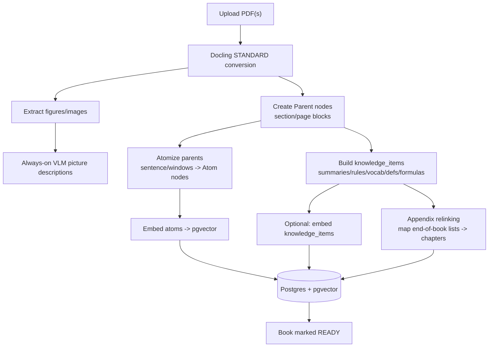
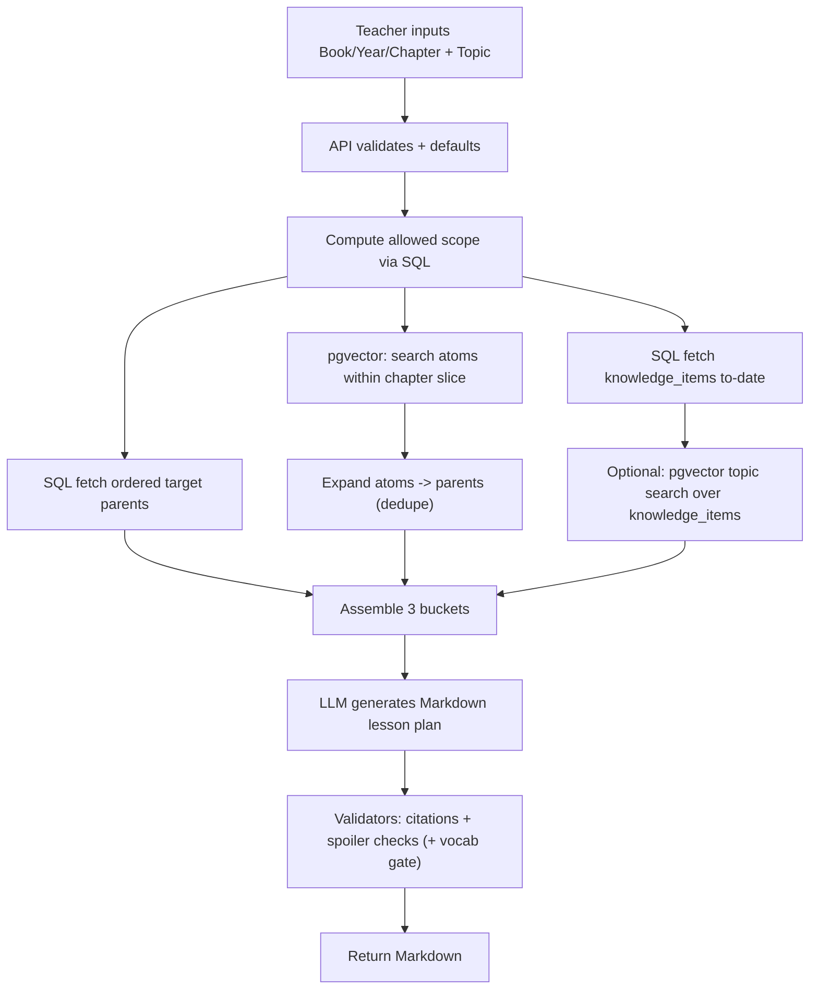

# TeacherCopilot — Architecture & Requirements (v1)

**Goal:** Generate logically sequenced, *textbook-grounded* lesson plans in Markdown with **sequential safety** (no spoilers) and **structure integrity** (tables/formulas/images preserved).

---

## 1) Non‑negotiable principles

- **Single-source authority:** The LLM must only use retrieved textbook content. If something is missing, it must say so.
- **Sequential safety:** Retrieval and generation are constrained to **≤ (current year, current chapter)**.
- **Structure integrity:** No mid-table or mid-sentence splits in the LLM context.
- **Auditability:** Each paragraph includes breadcrumbs (Book | Year | Chapter | Page | Section).
- **Generalizable across subjects:** Use a global **knowledge_items** layer (rules/definitions/formulas/vocab) with `introduced_at` gating.

---

## 2) Core concepts

### 2.1 Parent nodes (LLM context)
Structure-preserving blocks (section/page) that the LLM reads.

### 2.2 Atom nodes (retrieval units)
Small sentence/window snippets derived from parents; atoms reference `parent_id`.  
**Retrieve small, return big:** vector-search atoms → expand to parent nodes.

### 2.3 Knowledge items (global background)
Compact background artifacts (summaries, rules, vocab, definitions, formulas, procedures) with:
- `introduced_year`, `introduced_chapter` (sequential gating)
- optional `embedding` for semantic lookup
- provenance (page + source node IDs)

### 2.4 Chapter resources (appendix “re-homing”)
Links from appendix-derived knowledge_items (vocab/grammar/concept lists found at end-of-book) to the chapter they belong to.

---

## 3) Tech stack

- **Docling**: structure-aware conversion (STANDARD), always-on image/figure descriptions; optional full VLM pipeline fallback for scanned/complex PDFs.
- **Postgres + pgvector**: system of record for nodes + metadata + embeddings.
- **LlamaIndex (optional glue)**: PGVectorStore + child→parent (node references / recursive retriever) patterns.
- **Worker queue**: ingestion jobs (Docling, embeddings, summaries, appendix relinking).
- **LLM**: lesson generation + offline knowledge extraction.

---

## 4) Data model (single Postgres database)

You store *multiple logical datasets* (parents/atoms/global background) in **one Postgres database** via **two tables** (recommended) or one table (possible).

### Option A (recommended): 2 tables

#### 4.1 `text_nodes` (parents + atoms)
| column | type | notes |
|---|---|---|
| node_id | uuid PK | |
| book_id | text | e.g., `ESL_Vol3` |
| year | int | |
| chapter | int | |
| node_type | text | `parent` or `atom` |
| parent_id | uuid | atoms point to a parent |
| content_md | text | parent Markdown; atom snippet |
| page_no | int | for ordering |
| block_no | int | for ordering |
| section_path | text | e.g., `Unit 2 > Ch 7 > 7.2` |
| breadcrumbs | jsonb | extra tags + provenance |
| embedding | vector | **atoms only** (and optionally parents) |
| tsv | tsvector | optional keyword search |

#### 4.2 `knowledge_items` (global background)
| column | type | notes |
|---|---|---|
| item_id | uuid PK | |
| book_id | text | |
| item_type | text | `chapter_summary`, `rule`, `definition`, `formula`, `procedure`, `vocab_list`, `vocab_to_date`, `rules_to_date`, etc. |
| title | text | |
| content_md | text | compact, citeable |
| introduced_year | int | sequential gating |
| introduced_chapter | int | sequential gating |
| applies_to_year | int | chapter attachment (appendix) |
| applies_to_chapter | int | chapter attachment (appendix) |
| provenance | jsonb | source pages/node IDs |
| tags | jsonb | topic tags |
| embedding | vector | optional (for topic lookup) |

#### 4.3 `chapter_resources` (link appendix items to chapters)
| column | type | notes |
|---|---|---|
| chapter_parent_node_id | uuid FK | parent node ID for the chapter (canonical) |
| knowledge_item_id | uuid FK | |
| relation_type | text | `vocab`, `grammar`, `concept_overview`, `reference` |

---

## 5) Ingestion pipeline (offline)

### 5.1 STANDARD conversion + always-on image descriptions
1. Docling STANDARD conversion → structured doc (headings/tables/reading order).
2. Create **parent nodes** (page/section granularity).
3. Create **atom nodes** by splitting each parent into sentence/windows with overlap.
4. Compute embeddings for atoms (pgvector).
5. Extract **knowledge_items**:
   - `chapter_summary` per chapter
   - `vocab_list` / `grammar rules` (from chapter body and appendices)
   - `definition/formula/procedure` (STEM)
6. Run **appendix relinking** (below).
7. Mark book READY.

### 5.2 Appendix relinking (the hard part)
You do **not** physically move appendix text into chapter pages.  
You create knowledge_items from appendix sections and link them to the correct chapter.

**Algorithm**
- **Stage A (deterministic):** parse headers/table columns like “Chapter 7 Vocabulary”.
- **Stage B (heuristics):** infer mapping from nearby headings / block patterns.
- **Stage C (LLM fallback):** map appendix blocks → chapter keys using only the book TOC/headings; store confidence; flag low-confidence.

**Acceptance criteria**
- ≥95% of appendix entries mapped to a chapter boundary
- unmapped/low confidence items are flagged (no silent drops)
- every item has provenance

---

## 6) Runtime retrieval + generation (online)

### 6.1 Teacher intake (minimum)
- Book/Volume, Year, Chapter
- Topic
- Optional: length, intent, recap dial

### 6.2 SQL-first scope, pgvector-second selection
1. Compute allowed scope: `(year < Y) OR (year = Y AND chapter <= C)` plus recap dial rules.
2. **SQL fetch ordered target chapter parents** (coherence first).
3. **pgvector search atoms within the target chapter** (topic selection), then expand to parents.
4. Fetch **Global Background** from knowledge_items:
   - `*_to_date` rollups for the current boundary
   - `chapter_summary` for prior recap (dial-controlled)
   - optional topic top-k over knowledge_items
5. Assemble prompt buckets (below) → call LLM → validate output.

---

## 7) Prompt buckets (every generation call)

### Bucket 1 — GLOBAL BACKGROUND (knowledge_items)
- vocab/rules/definitions/formulas **to date**
- book/year overview
- optional topic-relevant knowledge_items (top-k)

### Bucket 2 — PRIOR RECAP (dial-controlled summaries)
- compact chapter summaries for allowed scope

### Bucket 3 — TARGET CORE CONTENT
- ordered parents from the target chapter
- plus topic-selected parents (atoms→parents), deduped and kept in textbook order

---

## 8) Diagrams (Mermaid)

### 8.1 Ingestion flow

### 8.2 User entry → lesson generation

---

## 9) Key sources (1 sentence each)

- Docling — structure-aware conversion library for complex PDFs with layout/table understanding and export formats (Markdown/JSON/HTML): https://github.com/DS4SD/docling
- Docling picture description (local VLM) example — add image descriptions even in standard conversion: https://ds4sd.github.io/docling/examples/pictures_description/
- Docling picture description (remote API) example — configure OpenAI-compatible multimodal endpoints (incl. self-host vLLM): https://ds4sd.github.io/docling/examples/pictures_description_api/
- LlamaIndex PGVectorStore example — store nodes + metadata in Postgres and apply metadata filters during retrieval: https://developers.llamaindex.ai/python/examples/vector_stores/postgres/
- pgvector docs — vector type + indexes + filtered ANN behavior and iterative scans: https://github.com/pgvector/pgvector
